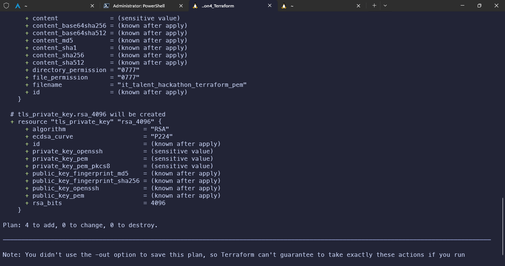

# 4º Hackathon

## Atividade 2: Terraform (Infraestrutura como Código)

### Versão do Terraform

### Criação do Arquivo de Script Principal

### Inicialização do Terraform

### Planejamento

### Aplicação

### Instância Criada

